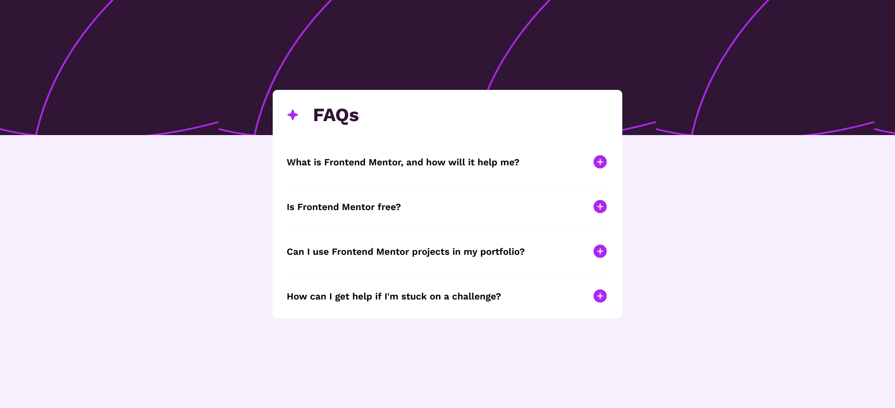

# Frontend Mentor - FAQ accordion solution

This is a solution to the [FAQ accordion challenge on Frontend Mentor](https://www.frontendmentor.io/challenges/faq-accordion-wyfFdeBwBz). Frontend Mentor challenges help you improve your coding skills by building realistic projects. 

## Table of contents

- [Overview](#overview)
  - [Screenshot](#screenshot)
  - [Links](#links)
- [My process](#my-process)
  - [Built with](#built-with)
  - [What I learned](#what-i-learned)


## Overview


### Screenshot



### Links

- Solution URL: [Add solution URL here](https://www.frontendmentor.io/solutions/faq-accordion-with-css-animations-3SghOKjQJa)
- Live Site URL: [Add live site URL here](https://faq-accordion-enkienki77s-projects.vercel.app/)

## My process

### Built with

- Semantic HTML5 markup
- CSS custom properties
- Flexbox
- Mobile-first workflow

### What I learned

I learned about the font property, which is a shorthand for a bunch of different font related properties, such as font-size, font-weight, font-family, line-height, etc. 

I realized that I could essentially make text property presets using css variables, and then just set those as the value for the font property for all of my text element. 

This made it really quick and efficient to set up the typogrophy for my site. It greatly reduced how verbose my typogrophy styles would be generally. 

```css
:root {
  --Display: 700 3.5rem "Work Sans", serif;
  --Display-Mobile: 700 2rem "Work Sans", serif;
  --Title: 600 1.125rem "Work Sans", serif;
  --Title-mobile: 600 1rem "Work Sans", serif;
  --Body: 400 1rem/1.5 "Work Sans", serif;
  --Body-mobile: 400 0.875rem/1.5 "Work Sans", serif;
}

body {
  margin: 0;
  height: 100%;
  font: var(--Body);
}
```

I also learned how to animate a details element 

The first thing you have to do is select the ::details-content pseudo element attached to the details element. If youre trying to look at it in dev tools you likely won't see it because it's actually a shadow dom element. You have to enable "Show user agent shadow dom" in the dev tools to be able to see it. 

This is what we'll actually be animating. If you try to animate the details or summary elements themselves it won't work.

So you set the details-content element to a height of 0 by default (it's closed state). Then to auto on it's open state, which you can select use an attribute selecter.

Lastly, to get the close state to animate we need to not only animate height but also content-visibility. If you look at details-content in the dev tools it has an attribute of content-visibility: none in it's closed state. This will get in the way of our animation. By default though animations on properties like display or content-visibiity don't work because these are properties with "discrete animation behaviour". So we need to set the transition-behavior property to "allow-discrete".

```css
:root {
  /* Allows transitions between a unit value such as 0px and a keyword value such as auto */
  interpolate-size: allow-keywords;
}

.faq-question-cont {
  overflow: hidden;
}

.faq-question-cont::details-content {
  height: 0;

  /* There's an attribute added to the shadow dom <details> element called content visibility when its in open state we   have to also transition this otherwise the closing animation wont work. */
  transition: height 1s, content-visibility 1s;

  /* Transitions on properties such as display and content-visibility are considered "Discreet" meaning they wont actually happen essentially. This declaration enables them. */
  transition-behavior: allow-discrete;
}

.faq-question-cont[open]::details-content {
  height: auto;
}
```